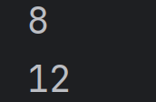
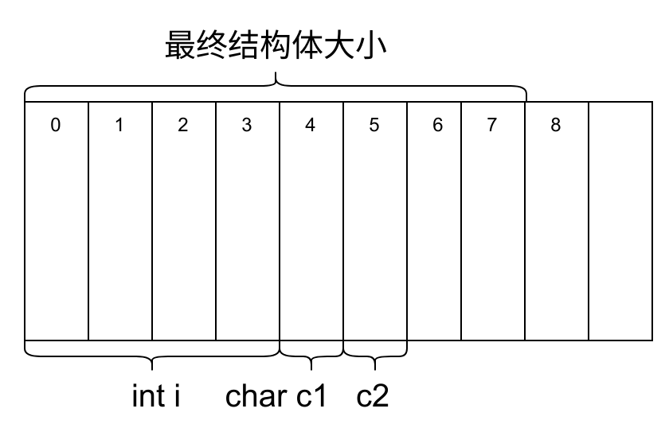
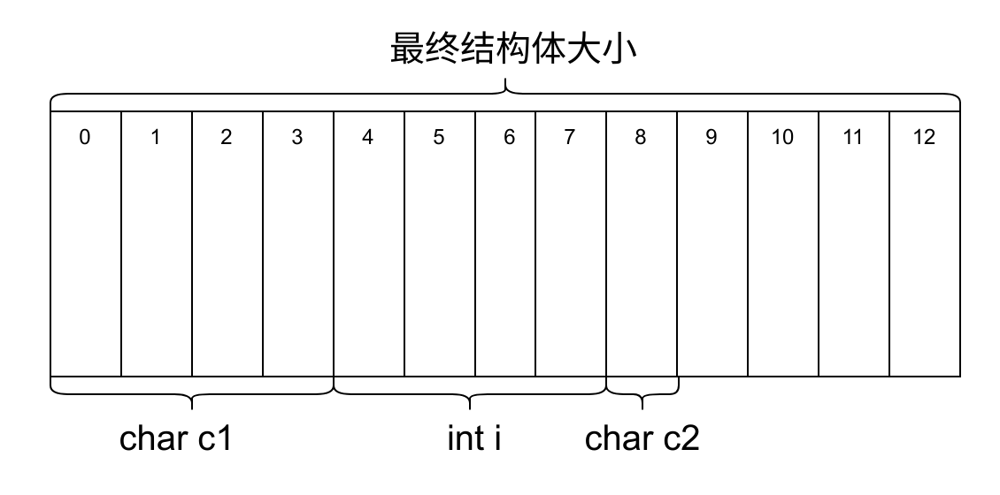
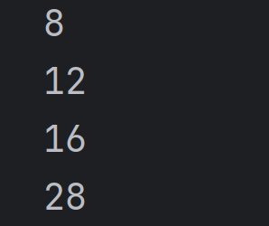
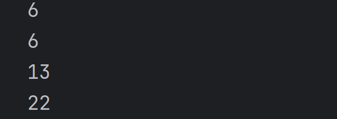

## 结构体、枚举、联合

自定义类型，区别与C语言的自带类型(int、char、double等)，由我们自己定义。

在C语言中共有3种自定义类型，分别是：结构体、枚举类型和联合体

---

### 结构体

结构体是一个集合类型，在结构体内，我们可以定义多个变量，这些变量称为成员变量。

### 结构体的声明：

```c
struct tag  //struct + 标签
{
   //成员变量
    ......
};//最后要加上‘;’分号
```

例如想要声明一个学生的类型的结构体：

```c
struct Student	//学生类型的结构体
{
    char name[20]; //姓名
    int age;		//年龄
    double height;	//身高
    char id[10];	//学号
    //......
    //其他属性均可自己来定义
};
```

特殊的声明：当我们想要创建的对象只需要使用一次，可以不写结构体名称，即：匿名结构体

```C
struct 
{
    int x;
    int y;
}a;
```

```
struct
{
	int x;
	int y;
	int z;
}arr[20],*p;
```

### 结构体的定义与初始化

有了类型，我们就可以定义变量，就像知道int类型就可已定义int类型的变量一样

```c
struct Point
{
    int x;
    int y;
    int z;
}p1;  //在声明类型的同时定义变量p1
struct Point p2; //定义结构体变量p2
//p1与p2的定义是一样的，唯一的区别是若p2在函数内部定义（如main函数）时会变成局部变量

//初始化：定义变量的同时赋值
struct Point p3 = {1,2,3};
//c99标准中支持了不按顺序初始化：
struct Point p4 = {.z=3,.x=1,.y=2};

struct Student
{
 char name[20];
 int age;      
};
//定义之后再初始化
struct Student s1; 
s1 = (struct Student){"张三", 18};//需要显式类型转换，不推荐

struct Node
{
    int data;
    struct Point p;
    struct Node* next;
}n1 = {6,{1,2,3},NULL};//结构体嵌套初始化

struct Node n2 = {6, {4,5,6}, NULL};//结构体嵌套初始化
```

#### typedef重定义结构体

由于每次定义结构体变量，我们总是需要写那么一长串来定义变量，比较麻烦，这时我们就可以使用typedef重定义结构体：

```C
typedef struct Student
{
    char name[20];
    int age;
}Stu;	//将 struct Student 重定义为 Stu
//以后创建变量，就可以写成：
Stu s1;
Stu s2;
```


### 结构体的自引用

顾名思义，既然我们可以使用声明一个结构体后可以使用结构体类型来创建变量，那么是否可以在结构体内部使自己的类型来创建一个自己的变量呢？答案是可以的，但是并不能直接创建

实例1：

```c
//比如这里想来一个套娃：
struct son
{
	char name[20];
	struct son next_son;
};
struct son s1;
```

这时我们创建一个变量s1，他的内部会有一个名字，并有他的儿子,而创建了他的儿子之后里面又生成了儿子的儿子的儿子.......最终无穷无尽递归下去，所以不能这么写。即便是可以，如果计算**sizeof(struct son)**会算出什么来呢？我们不得而知。

因此正确的方式是：

```c
struct son
{
    char name[20];
    struct son* next_son;
}
struct son s1;
```

在创建一个变量s1后，s1会有自己的名字，而s1内部的指针不用时可以置为空，在使用时就可以指向下一个儿子

```c
struct son
{
    char name[20];
    struct son* next_son; 
}s1,s2;
s1.next_son = &s2;//存放s2的地址,当然我们一般不会这么写，下面会有别的写法

s2.next_son = NULL;
```

而之后数据结构中的链表，就需要使用这种方式：

```c
struct Node
{
    int data;
    struct Node* next;
};
```

#### 注意：

一个错误的写法：

```c
typedef struct 
{
    int data;
    Node* next; // 错误！此时编译器尚未识别 "Node" 类型
} Node;
```

在结构体定义内部，成员 `Node* next` 试图使用 `Node` 作为类型名，但此时 `typedef` 尚未完成对匿名结构体类型的重命名。编译器在解析结构体成员时，`Node` 还未被定义，因此会报错：`unknown type name 'Node'`。

因此正确的方式是：

```c
typedef struct Node 
{
    int data;
    struct Node* next;
} Node;
```

### 结构体成员变量的访问

使用结构体创建变量后，要访问变量内的数据要用到两个操作符：`.`和`->`普通变量使用`.`来访问成员变量，指针类型使用`->`来访问成员变量。例如：（malloc函数可以看这篇[C语言动态内存管理](https://www.qmtt.wang/2025/03/16/%E5%8A%A8%E6%80%81%E5%86%85%E5%AD%98%E7%AE%A1%E7%90%86/ "C语言动态内存管理"))

```c
#include <stdio.h>
#include <stdlib.h>
#include <string.h>

typedef struct Student {
    char name[20];
    int age;
    int id;
} Student;

int main() {
    Student s1 = {"张三", 18, 123456};
    //普通类型访问成员变量
    Student s2;
    strcpy(s2.name, "李四");//将"李四"拷贝给s2.name
    s2.age = 18;
    s2.id = 654321;
    printf("%s-%d-%d\n", s1.name, s1.age, s1.id);
    printf("%s-%d-%d\n", s2.name, s2.age, s2.id);
    
	//指针类型访问成员变量
    Student* s3 = (Student*)malloc(sizeof(Student));
    strcpy(s3->name, "小明"); 
    s3->age = 18;
    s3->id = 1345678;
    printf("%s-%d-%d\n", s3->name, s3->age, s3->id);
    free(s3);
    s3 = NULL;

    return 0;
}
```

### 结构体的大小

我们熟知char类型变量占1个字节，int类型变量占4个字节，long long类型变量占8个字节，那么我们自己定义的结构体类型占多大的空间呢？

这里运行

```c
struct S1
{
	int i;
    char c1;
    char c2;
};
printf("%d\n", sizeof(struct S1));
```

```c
struct S2
{
    char c1;
    int i;
    char c2;
};
printf("%d\n", sizeof(struct S2));
```

明明成员变量的类型都一样，运行完后我们得到了两个不同的结果：



这就涉及到**结构体内存对齐**：

#### 基本对齐规则：

1. 首成员对齐

   结构体的第一个成员从偏移量0的地址开始存放

2. 成员偏移对齐

   其他成员变量与一个对齐数的整数倍的地址处对齐（其中**对齐数为编译器默认对齐数与该成员大小的较小值**）即：

   **对齐数=min(编译器默认对齐数，该成员大小)**（Linux下gcc的默认对齐数为4，Windows下msvs默认对齐数为8，这些均可自己设置）

3. 每个成员都有自己的对齐数，结构体的总大小为最大对齐数的整数倍

4. 如果结构体嵌套了结构体，嵌套的结构体对齐到内部最大成员对齐数的整数倍处，结构体的整

   体大小就是所有最大对齐数（含嵌套结构体的对齐数）的整数倍

就比如：(预编译指令#pragma pack()可以设置默认对齐数)这里以4为例

```c
#pragma pack(4)//设置默认对齐数为4
struct S1
{
	int i;		//i占4个字节，第一个成员在0处放置  
    char c1;	//c1占1个字节，1<4,放在直接放在i的后面
    char c2;	//同上
};//上面 4+1+1=6
printf("%d\n", sizeof(struct S1));
//最终为最大对齐数的整数倍也就是4的整数倍:8
```



第二种：

```c
struct S2
{
    char c1; //第一个位置
    int i;	//4=4,与4的倍数处即4处对齐
    char c2;//1<4,前面已经排到的7的位置，因此放到8处
};//4+4+1=9
printf("%d\n", sizeof(struct S2));
//最终应为最大对齐数（这里面是4）的整数倍：12
```



同理下方：

```c
struct S3
{
 double d;	//位置0处，后面占8个字节（0~7）
 char c;	//位置8处，占一个字节(8)
 int i;		//位置12处，占4个字节(12~15)
};//8+4+4=16,恰好为4的倍数
printf("%d\n", sizeof(struct S3));//最终为16
//这里由于我用的编译器是gcc，double的默认对齐数是4，vs下默认对齐数是8
//结构体嵌套问题
struct S4
{
 char c1;   //位置0处，1个字节(0~3)
 struct S3 s3;//位置4处，内部最大对齐数为4，4=4，s3共占16个字节(4~19)
 double d;//4=4,位置20处(20~27)
};//4+16+8=28,最终应为4的倍数：28
printf("%d\n", sizeof(struct S4));
```

所以下面所有运行结果：

```c
#pragma pack(4);
#include <stdio.h>
int main() {
struct S1
{
 int i;
 char c1;
 char c2;
};
printf("%d\n", sizeof(struct S1));
struct S2
{
 char c1;
  int i;
 char c2;
};
printf("%d\n", sizeof(struct S2));
struct S3
{
 double d;
 char c;
 int i;
};
printf("%d\n", sizeof(struct S3));
struct S4
{
 char c1;
 struct S3 s3;
 double d;
};
printf("%d\n", sizeof(struct S4));
}
```



如果把默认对齐数修改成1，就可以相当于以成员变量来计算大小，此时输出结果：



因此我们得出结论：在设计结构体的时候，应尽量让占用空间小的成员集中在一起，才能更节省空间。

### 


