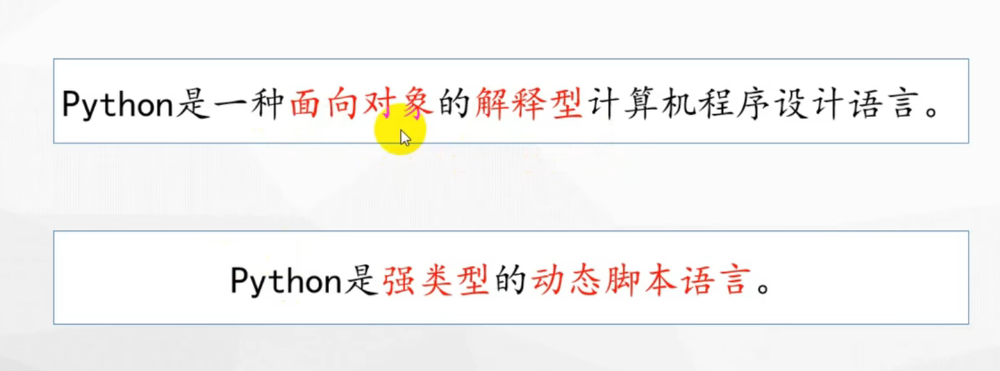

python是一种面向对象的解释型高级编程语言

强类型的动态脚本语言




## print函数

```python
print("hhhh","hhhhh") 	#输出：hhhh hhhhh
#sep 用来间隔多个值,不写默认是空格
print("hhhh","hhhhh",sep=',')	#输出：hhhh,hhhhh
#end 设置结尾，不写默认是换行\n
print("hello",end=" ")
print("world")
```

## 变量，标识符

```python
a=1
b=2
c=a+b

```

标识符：定义的变量名，不能用关键字（if,else,等）

## 数值类型

整型：int	1，2，3

浮点数：float	1.1，1.3

布尔型：bool	True(1)/False(0)

复数：complex	 z=a+bj

查看类型：

```python
print(type(...))
```

## 字符串

str   ""或’‘

```python
st = "qqq"
s = 'www'

name = """hhhhhhh
llllll
jjjjjj
"""
# 多行注释也是引号
print(name)
```

### 字符串编码转换：


```
a="hello"
a1=a.encode("utf-8")
print("编码前a:",a)
print("编码后a1:",a1)
print(type(a1))

a2 = a1.decode()#解码
print("解码后a2:",a2)
print(type(a2))
```

### 字符串常见操作


### 下标/索引

字符串名[下标]

从左往右数：下标从0开始

从右往左数：下标从-1开始

#### 切片

[起始,结束,步长]	步长也要遵循正负号方向

还是包前不包后原则

[x: ]	x到结尾

[ :y]	开头到y的前一个

### 字符串的查找、修改、判断


## 格式化输出

### 1.占位符

```python
#占位符
name = ("qmtt")
print("我的名字：%s" % name)
age = 19
print("我的名字:%s,我的年龄：%d" % (name, age))
# 控制长度
print("%4d" % age)
# 控制输出位数前面用0补全
print("%04d" % age)

#浮点数
a = 1.12345691022
print("%f" % a) #默认输出6位小数，多出来了四舍五入
# 设置小数位数,遵循四舍五入
print("%.10f" % a)

# %%输出一个%
print("我是%%的%%" %())
```

### 2.f格式化

```python
# 格式：f"{表达式}"
name = "qmtt"
age = 19
print(f"名字：{name},年龄：{age}")
```

## 运算符

### 算术运算符


注意：

使用/商一定是浮点数且除数不能为0

使用算术运算符,若使用浮点数，结果也用浮点数表示

### 赋值运算符

```python
a=10
#a=a+1
a+=1
a-=1
```

## 输入函数input

输入的为字符串类型（str）

```python
#input
name = input("请输入姓名：")
print("Hello, " + name)
print(name)
```

## 转义字符


```
age = input("What is your age?")
age = int(age)
if age >= 18:
    print("成年")
```

补充：

```python
print(r"as\\\\dfg")##原生字符串，取消转义
```

## if判断

### 基本判断

```python
age = input("What is your age?")
age = int(age)
if age >= 18:
    print("成年")
```

### 其他


## 循环语句

### while循环


### for循环

```python
#for 临时变量 in 可迭代对象：
#字符串就是可迭代对象

# 计数：

# range()用于记录循环次数，相当于一个计数器
# range(start,stop,step)   左闭右开[ )
for i in range(1,10):
    print(i)
```

break：结束循环

continue：跳过当此循环，进如下一次循环

### 列表


 #### 列表操作：增删查改


##### 添加元素

```python
li = [1,2,3,4,'a','d']
print(li,type(li))
print(li[0],type(li[0])) #有序，可以通过下标访问
print(li[0:3]) #切片操作
#列表也是可迭代对象，可以for循环遍历取值
#列表的常见操作：增删查改
#1.添加元素
li1 = ['one','two','three']
li1.append('four')  #append 整体添加
li1.extend('five')  #分散添加，将元素逐个添加，且里面只能填写可迭代对象
li1.insert(1,'six') #指定位置插入元素，有元素就会后移
print(li1)
```

##### 修改元素

下标修改

##### 查找元素

和字符串一样

```python

name_list = ['zhangsan','lisi','wangwu']
while True:
    name = input('请输入您的名字：')
    if name in name_list:
        print('已存在，请重新输入')
    else:
        name_list.append(name)
        print(f'成功添加{name}')
        print(name_list)
        break

```

##### 删除元素

```python
li = ['a','b','c','d','e']
#del li   #删除列表
del li[0] #删除元素
a = li.pop()
li.remove(a) #删除指定元素，重复的话删除第一个
print(li)
print(a)
```

##### 排序

```python
li = [4,1,5,3,7,2]
li.sort()   #从小到大排序
li.sort(reverse=True) #从大到小
li.reverse() #逆置
print(li)
```

#### 列表推导式

```python
# 列表推导式
# 格式1：[表达式 for 变量 in 列表]
# in后面不仅可以放列表，还可以放range(),可迭代对象
li = [1,2,3,4,5,6,]
[print(i*2) for i in li] #前面的i是表达式

li1=[]
# for i in range(1,6):
#     print(i)
#     li1.append(i)
# print(li1)
# 使用列表推导式更简单的写法
[li1.append(i) for i in range(10)]
print(li1)

#格式2：添加一种条件
# [表达式 for 变量 in 列表 if 条件]
# 把奇数放到列表里面
li2 = []
[li2.append(i) for i in range(10) if i%2 != 0]
print(li2)
```

#### 列表嵌套

列表里面嵌套列表

```python
li = [1,2,3,[1,2,3]]
print(li[3])
print(li[3][1])
```

### 元组

```python
# 元组tuple
# 基本格式：元组名 = （元素1，元素2，元素3...）
# 小括号
tua = (1,2,3,4,5,'a','c',[1,2,3])
tub = (1,) #只有一个元素的时候，末尾一定要加上‘，’，否则会变成这个元素的数据类型
print(type(tua))
print(tua)

# 元组与列表的区别
# 1.元组若只有一个元素，末尾必须加‘,’
# 2.元组只支持查询操作，不支持增删改
tua1 = (1,2,1,3,4,5,'a','c',[1,2,3])
# tua1[0]= 2  # 会报错
print(tua1[0])
# count(),len(),index(),切片用法和列表相同
print(tua1.count(1))
print(len(tua1))

# # 应用场景
# # 格式化输出，后面的（）本质上就是一个元组
# # 数据不能被修改的时候
name = "qmtt"
age = 18
info = (name,age)
print("姓名是%s,年龄是%d" % (name,age))
print("姓名是%s,年龄是%d"% info)
```

### 字典

#### 基本格式

```python
# 字典
# 基本格式：字典名 = {键1:值1,键2:值2,...}
dic = {'name':'qmtt','age':19}
print(type(dic))
dic1 = {'name':'qmtt','name':'qwer'}
print(dic1) # 第一个会被第二个覆盖
#字典中的键具有唯一性，但是值可以重复
```

#### 常见操作

##### 查找元素

```python
# 常见操作
# 1.查看元素
# 变量名[键名]
dic = {'name':'qmtt', 'age':66}
print(dic['name']) #字典中不能根据下标来访问元素，键名不报错会报错
print(dic['age'])
# 变量名.get(键名)
print(dic.get('age')) # 若键名不存在，默认返回None
print(dic.get('hh', '不存在'))# 若不存在，返回自己设置的默认值
```

##### 修改元素

```python
# 修改元素
# 变量名[键名] = 值
dic = {'name':'qmtt','age':19}
dic['age'] = 99
print(dic)
# 键名存在就会修改，不存在就会新增
```

##### 删除元素

```python
# 删除元素
#  1.del
# del 字典名 删除整个字典
# del 字典名[键名] 键值对不存在就会报错
dic = {'name': 'qmtt', 'age': 19}
del dic['age']

# 2.clear 清空字典里的东西，但是保留字典
dic.clear()
print(dic)

# 3.pop
dic = {'name': 'qmtt', 'age': 19}
dic.pop('age')
dic.popitem()#可以指定，默认删除最后一个元素
print(dic）
```

##### 常见操作2


```python
# 字典常见操作2
dic = {'name':'qmtt','age':20}
print(len(dic))  # len求长度
print(dic.keys()) # 取出所有键名
# for循环取出键名
for i in dic.keys():
    print(i)

print(dic.values()) # 返回所有值
print(dic.items()) # 返回所有键值对,以元组的形式
print(dic)
# 字典的应用场景:
# 用键值对,存储描述一个物体的相关信息
```

### 集合

```python
# 集合 set
# 基本格式:集合名= {元素1,元素2,元素3}
# 集合具有无序性
s = {} # 定义空字典
s1 = set() # 定义空集合
print(s1,type(s1))

s2 = {'a','b','c','d','a','d'}
print(s2) #每次运行的结果不一样
s3 = {1,2,3,4,5}
print(s3) #每次运行的结果一样
# 原因:
# 集合无序的设计方式涉及哈希表
print(hash('a')) #
print(hash('b'))
print(hash('c'))
# 每一次运行结果都不一样

# 利用无序性,不能修改集合里的值
# 集合具有唯一性,可以自动去重
```

#### 常见操作


交集:&

并集:|

### 类型转换


### 深浅拷贝

#### 浅拷贝

```python
# 深浅拷贝
# # 赋值,两个对象会一起发生变化
# li = [1,2,3,4]
# print(li)
# li2 = li #将li赋值给li2
# print(li2)
# li.append(5)
# print(li)
# print(li2) #会发现这里li和li2都发生了变化

# 浅拷贝(数据半共享)
# 会创建新的对象,拷贝第一层的数据,嵌套层会指向原来的内存地址
import copy # 导入copy模块
li = [1,2,3,[4,5,6]] #定义一个嵌套列表
li2 = copy.copy(li)
print(li)
print(li2)
# 查看内存地址
print(id(li))
print(id(li2))
# 内存地址不一样,说明不是同一个对象
li[3].append(7)
print(li)
print(li2) #会发现还是被修改了
# 外层的地址不同,但是内层的地址相同
# 优点:拷贝速度快,占用空间少,拷贝效率高

# 深拷贝:数据完全不共享
# 外层的对象和内部的元素全部拷贝了一遍
```

#### 深拷贝

```python
# 深拷贝:数据完全不共享
# 外层的对象和内部的元素全部拷贝了一遍
import copy
li = [1,2,3,[4,5,6]]
li2 = copy.deepcopy(li)
```

###　可变对象

存储空间保存的数据允许被修改，这种类型就是可变类型

常见可变类型：

- 列表 list
- 字典 dict
- 集合 set

### 函数

#### 基础语法

```python
# 函数
# def 函数名()
#     函数体
def login():
    print("这是登录函数")
    return "登录函数",1,2

print(login()) #可以返回多个值，以元组的形式返回
# 没有返回值，返回none
# return 表示函数结束

def add(x,y):
    return x+y
print(add(1,2))
```

#### 函数参数

```python
# 1、必备参数（位置参数）
# 含义：传递和定义参数的顺序及个数必须一致
# 格式： def func(a,b)

# 默认参数
# 含义：为参数提供默认值，调用函数时可以不传该默认参数的值
# 所有位置参数必须出现在默认参数前，包括函数定义和调用
# 格式：def func(a,b,c=1)

# 可变参数
# 传入的值的数量是可以改变的，可以传入多个，也可以不传
# 格式：def func(*args)
def func(*args):
    print(args)
    print(type(args))
func(1,2,3,4) # 以元组的形式接收

# 关键字参数
# 格式： def func(**kwargs)
def fund(**kwargs):
    print(kwargs)
    print(type(kwargs)) # 以字典的形式传值
fund(name = 'hhhh',age=999)
# 作用：可以拓展函数的功能
```

#### 作用域

```python
# 作用域：
# 含义：变量生效的范围
# 全局变量：函数外部的变量，在整个文件中都是有效的
# 函数内部使用变量，会先从函数内部找，有的话直接使用，没有的话会到函数外面找
# 局部变量：函数内部定义的变量，从定义位置到函数结束位置有效
# 只能在被定义的函数中使用，外部不能使用
# 在函数内部被定义，函数调用完成后就销毁


# 函数内部无法修改全局变量的值，更改完全局变量的值并不会改变
# 若要在函数内部修改全局变量的值，要用到关键字global

a = 10
b = 20
def func():
    a = 100
    global b
    b = 200

func()
print(a,b)
```

```python

# nonlocal
# 用来声明外层的局部变量，只能在嵌套函数中使用，
# 在外部函数先进行声明，内部函数进行nonlocal声明

a = 10
def outer():    # 外函数
    a = 5       # 局部变量
    def inner():    #内函数
        nonlocal a
        a = 20 # 同时对上一层进行修改（上上层不会被修改）
        print('内函数中a的值:',a)

    inner()
    print('外函数中a的值:',a)

outer()
print(a)
```

```python
# 匿名函数(参数和上面一样)
# 语法：
# 函数名 = lambda 形参 : 返回值
# 调用: 结果 = 函数名(实参)
#
# def add(a,b):
#     return a+b

add = lambda a,b: a+b
print(add(1,2))
```

