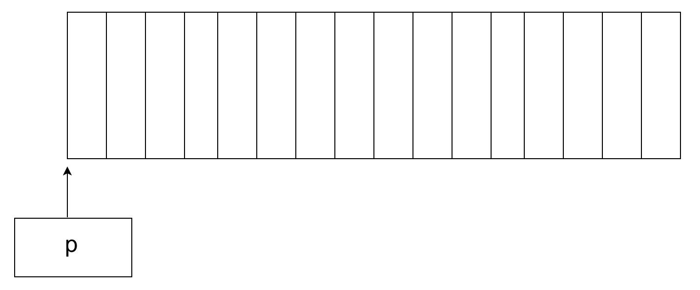
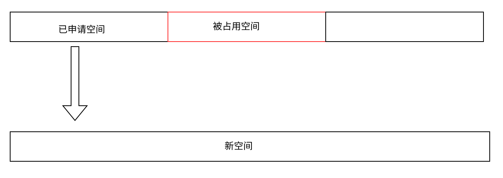
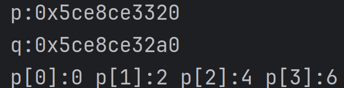

在C语言中，我们已经知道有两种方式来获取内存空间：定义变量和创建数组

```c
int x = 10;//在栈空间获取4个字节来存储10
int arry[10];//在栈区获取10个字节的连续空间
```

他们特点很明显：内存空间都是固定的，数组也需要在声明的时候就指定长度（但c99中支持了数组定义时[]内写变量）。

但是实际情况是：在有些情况下只有程序运行的时候我们才知道它需要多大的内存，而那时原先申请固定内存已经不满足了。这个时候就需要来动态开辟内存。

C语言中共有三个申请内存空间的函数：malloc ， calloc ，realloc，也提供了一个将空间还给内存的函数：free。这四个函数都在头文件**stdlib.h**中声明。

### malloc和free

malloc函数的原型：

```c
void* malloc(size_t size);
```

size_t为无符号整形，即在内存中申请一块连续可用的大小为size的空间（大小为字节）， 若申请并开辟成功，则返回值是指向这块空间起始位置的指针，类型为void* 需要我们自己来决定申请的类型。若申请失败，则返回NULL，因此使用mallloc函数时需要做检查。如果参数 size 为0，malloc的行为是标准是未定义的，出现的情况取决于你使用编译器。

例如申请一个16字节的空间

```C
int *p = (int*)malloc(4*sizeof(int));
//或
int *p = malloc(4*sizeof(int));
//在c语言中void*可以隐式类型转换，这里推荐第一种显式类型转换，可提高代码可读性
```

这样p就指向了一个16字节的空间:



有借有换，再借不难。我们向内存申请了空间，当我们不需要的时候，就需要将空间还给内存，C语言提供了free函数来对内存进行释放和回收，否则会有内存泄露的风险。函数原型：

```c
void free (void* ptr);
```

free用来释放我们自己动态开辟的内存，不能释放非动态开辟的。

举例：

```c
#include <stdio.h>
#include <stdlib.h>
int main()
{
    int n = 0;
    scanf("%d",&n);
	int* p = NULL;
    p = (int*)malloc(n*sizeof(int));//申请4*n个字节的空间，即n个整形
    if(p!=NULL)		//判断是否申请失败
    {
        for(int i=0;i<n;i++)
        {
            *(p+i)=0;	//int*型指针，每次+1跳过4个字节，将n个整形全部赋值为0
                //其实这里对于整形指针p指向空间的访问既可以写:*(p+i),更直观的写法是:p[i]两种写法是等价的，就像数组一样
            	//其他类型的指针也是一样的，比如char*指针*(p+1)一次跳过1个字节
            	//long long一次8个字节
        }
    }
    //在使用完以后，就需要释放掉p所指向的空间
    free(p);
    p=NULL;//这里要注意的是我们只是将空间还给了内存，p对该区域不再有访问权限，但是它仍指向了这个位置即现在p指向了非法的位置，成了野指针，因此需要置空。
    return 0;
}
```

### calloc

calloc函数原型：

```c
void* calloc(size_t num,size_t size);
```

calloc函数的功能:是为num（元素个数）个大小为size（一个元素所占的字节数）的函数申请一块空间，并且把空间内的每个字节都初始化为0

**calloc与malloc函数区别就是将每个字节都置为0且calloc函数可自定义每个元素长度**，calloc更适合初始化大型数据结构，比如创建数组或结构体

举例：

```c
#include <stdio.h>
#include <stdlib.h>
int main()
{
    int* p = (int*)calloc(4,sizeof(int));//申请4*4个整形的空间，即4个整形
    /*
    if(p!= NULL)
    {
        //这里直接就可以使用，无需自己初始化。
    }
    */
    //或者另一种判断是否为空的方法：
    if(p==NULL)
    {
        exit(-1);//中间可以填任意非0数字，在申请内存失败时就可以终止程序并终止程序
    }
    //.....使用空间
    
    //释放空间
   	free(p);
    p=NULL;
    return 0;
}
```

### realloc

realloc函数可以对我们申请到的空间动态的调整。函数原型：

```c
void* realloc(void* ptr,size_t size);
```

ptr为我们要调整内存的地址，size是重新调整之后的大小。返回值仍然是是调整之后的内存起始位置。

当我们缩小空间时，会直接在原空间后面切除。如果后面有数据也会直接丢失。

```c
int* p = (int*)malloc(10);
p = realloc(p,5);//由10个字节缩减为5个字节
```


当我们放大空间时就会有问题：

我们知道申请的空间在内存中是连续的，所以在使用realloc函数拓展内存时我们会遇到两种情况：

第一种是后面的内存够用：会直接往后延长


第二种是后面的内存不够用：



此时realloc会在堆区找一块新的连续空间，将原内存块的数据拷贝到新内存，然后再释放掉原内存块。

```c
#include <stdlib.h>
#include <stdio.h>
int main() {
    int* p = (int*)malloc(4*sizeof(int));
    for (int i = 0; i < 4; i++) {
        p[i] = i*2;
    }//p的四个值分别是0,2,4,6
    int* q = p;//使用q来记录p的地址
    
    //再申请多块空间
    int* a = (int*)malloc(4*sizeof(int));
    int* b = (int*)malloc(4*sizeof(int));
    int* c = (int*)malloc(4*sizeof(int));
    //.....
    
    p=realloc(p, 100000);	//将p扩大到10000个字节
    printf("p:%p\n", p);//查看现在p的地址
    printf("q:%p\n", q);//查看原来p的地址
    for (int i = 0; i < 4; i++) {
        printf("p[%d]:%d ",i,p[i]);//访问现在p内的数据
    }
    free(p);
    //free(q);
    free(a);
    free(b);
    free(c);
    p=q=a=b=c=NULL;
	return 0;
}
```

这是输出结果：可以看到p的地址发生了改变。



这时就要考虑一个问题：要是realloc失败了呢？

此时p就会得到一个NULL，而原数据就消失在内存的茫茫大海中了（并不会被释放）此时我们丢了数据又泄露了内存。而解决方法就是和上面一样：使用一个临时指针来接受返回值，若失败了仍然可以操作原内存。

```c
int *p = (int*)malloc(10 * sizeof(int));
int *tmp = realloc(p, 1000 * sizeof(int));
if(tmp!=NULL)
{
    p=tmp;//这样就可以避免原指针丢失
    tmp=NULL;
}
```

### 动态内存常见的问题：

1. 内存泄露：使用了malloc但是未释放内存

2. 重复释放内存：

   ```c
   free(p);
   free(p);//对同已块空间连续释放两次，会导致程序崩溃
   //解决方法是：释放完内存后立即置空
   //即：
   free(p);
   p=NULL;
   //这时再free(p)就不会报错了
   ```

3. 迷航指针

   ```c
   int* p = malloc(100);
   free(p);
   *p = 10;//这里操作已经释放的内存
   ```

   解决方法同上：操作完就置空free(p);p=NULL

4. 对非动态开辟的内存free释放

   ```c
   int main()
   {
   	int a = 10;
       int* p = &a;
       free(p);//这里会报错
   }
   ```

5. 使用free释放动态开辟内存的一部分

   ```c
   int* p = (int*)malloc(10);
   p++;
   free(p);//这时p已经指向了下一个位置，解决方法是使用*(p+i)即p[i]或者使用新指针指向下一个位置
   ```

6. 申请多少内存就只能使用多少内存，不能越界访问。
